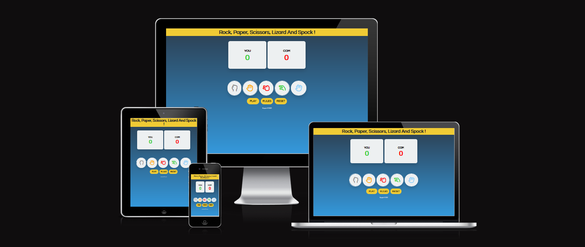
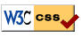

# Rock Paper Scissors Lizard Spock Game #

Here I have created a Rock Paper Scissors Lizard Spock game which originated from the great TV show called The Big Bang Theory.
It consists of your basic Rock Paper Scissors Rules along with two more choices for a bit more of a twist into the game. Here you get a chance to battle it out against the computer in a best of 10 at which whoever gets to 10 first wins!.

The live version of the game is available for you to try here : <a href="https://kryspinm97.github.io/Rock-Paper-Scissors-Lizard-Spock-Game/">Rock,Paper,Scissors,Lizard and Spock!</a>

# ReadMe Contents # 

* ## [UX](#ux-1)
* ## [Testing](#testing-1)
* ## [Validator](#validator-testing)
* ## [Deployment](#deployment-1)
* ## [Credits](#credits-1)

# UX #

## User Stories ##

  * As the site owner I want : 
  
    * Create a visually appealing, responsive game
    * Functional yet Simple to navigate and use
    * Not cluttered visually and with everything clear to the user
    * Provide a set of rules for players understanding of the game
    * Contain a reset button in a case where player wants to start over again
    * Incrementing score for both the player and computer

  * As the user, I would want : 

    * To have the ability to play against a computer
    * Easily navigate game buttons and options
    * Have the information about rules available to me
    * Be able to play again after finishing game

## 1. Strategy ##

  * Purpose of the Project 

    * Let users have a try at the game against the Computer in a best of 10 style (Rock, Paper, Scissors, Lizard and Spock) game. 

## 2. Scope ## 

  * I wanted a aesthetically clean UI
  * I wanted an ability to play against the computer
  * I wanted to have a popup modal that displays the set of rules on click
  * I wanted to have a popup modal that comes up after the game is finished with the game result of whichever player won, with the ability to Play Again.
  * I wanted a reset button in case user wanted to start over.

## 3. Structure ##

* Header consisting of the game name , identifying it to the user of what it is about.
* Player and Computer central score area, that holds the score count for both the Player and Computer, which increments while winning / losing rounds.
* An Element that comes up with a round result message if you have won or lost or it was a draw. 
* A layout of interactive buttons that display the game options of (Rock, Paper, Scissors, Lizard and Spock).
* Option Buttons that allow the user to click Play to begin the game, click Rules to display the rules of the game and click reset to start the game over again.
* Copyright footer at the bottom of the page to credit the creator.

## 4. Skeleton ## 

* I have used the Balsamiq Wireframes software for the initial development of this project which helped me guide my mind onto where to place my game elements and information.

## 5. Surface ##

 * Theme Selection 
    * I have went with a linear gradient option for the theme background of my page as I felt like it is least invasive of grabbing attention away from the player if I was to use a game-style background, along with few other choices of colors for buttons / text.
     
    The main colors of the buttons, background, text.

  
  

  * Font Selection 
    * The font I have went with for this project is : Questrial , which I have sourced from the google fonts page.

# Testing # 

 * I have tested the game on Google Chrome, Firefox and Safari browser with no issues
 * All the buttons and game functions work correctly 
 * Score incrementing works as intended
 * Computer choice randomisation works properly
 * Button interaction feels responsive and smooth
 * Have also tested the game on different devices using the DevTools Device list working good.
 * Buttons reposition themselves along with the computer and player score as screen gets smaller

# Validator Testing #

* ### HTML ###
  * No errors found during the W3C validator for HTML documents

* ### CSS ###
  * No errors found during the Jigsaw validator for CSS documents

  * The document validated at CSS level 3 + SVG

   

* ### JS ###
  * No errors found during the JSHint validator for JavaScript code
  * Only recieving a warning about Two unused variables of - toggleModal and playAgain as those are onclick functions that are defined in the HTML.
    
* ### Accessibility ###

  * I have performed a lighthouse dev tools test that everything was working well, no big loading times and with clear chosen colors.

  

# Deployment #

  * The steps followed to deploy the site are as follows : 
  * In the GitHub repository, navigate to the Settings tab;
  * From the source section drop-down menu select Pages , from branch select main.
  * Once the branch has been selected the live version of the page will be deployed.

  * You can find the deployed version of the game here : <a href="https://kryspinm97.github.io/Rock-Paper-Scissors-Lizard-Spock-Game/" target="_blank">Rock,Paper,Scissors,Lizard and Spock!</a>

# Credits #

### Coding ###

* <a href="https://google.com">Google</a>
* <a href="https://ui.dev/amiresponsive">AMI Responsive</a>
* <a href="https://stackoverflow.com/">Stack Overflow</a>
* <a href="https://youtube.com">YouTube</a>
* <a href="https://w3schools.com">W3Schools</a>
* <a href="https://https://codeinstitute.net/">Code Institute</a>

* All those resources were very valuable in the progression of my project whenever I was stuck at any point in time I refered back to the course material as well as the online resources.

* I have used Youtube as a guide on how to create pop up modals as I've had no previous experience in doing them. These have definitely added responsiveness and interaction within my game and were a great addition.

I would like to thank Code Institute for supplying me with the necessary guidance for this project and also my mentor Rahul in guiding me in the right direction.

[def]: #credits